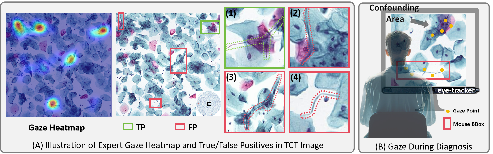
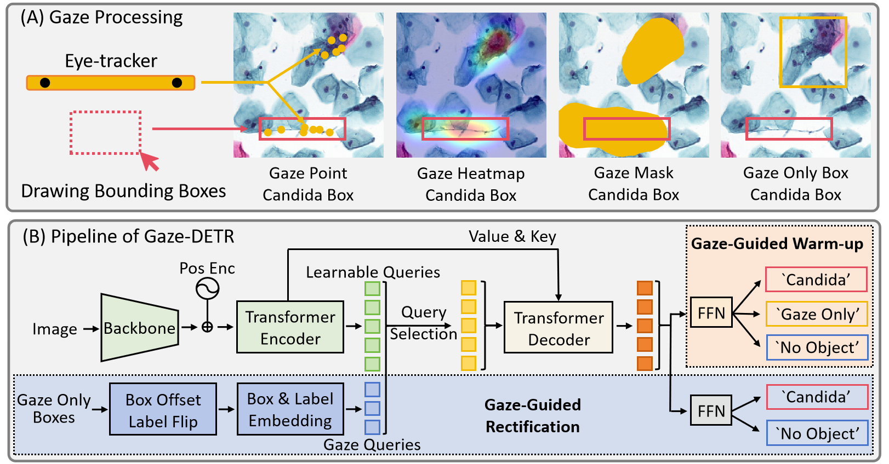

# Gaze-DETR: Using Expert Gaze to Reduce False Positives in Vulvovaginal Candidiasis Screening


## Useful links

<div align="center">
    <a href= class="button"><b>[checkpoint]</b></a> &nbsp;&nbsp;&nbsp;&nbsp;
    <a href= class="button"><b>[paper]</b></a> &nbsp;&nbsp;&nbsp;&nbsp;
</div>

## Method


## Usage

### Installation

We test our models under ```python=3.7.3,pytorch=1.9.0,cuda=11.1```. Other versions might be available as well.

```sh
# Clone this repo
git clone https://github.com/YanKong0408/Gaze-DETR.git
cd Gaze-DETR

# Install Pytorch and torchvision
# We test our models under `python=3.7.3,pytorch=1.9.0,cuda=11.1`. Other versions might be available as well.
conda install -c pytorch pytorch torchvision

# Install other needed packages
pip install -r requirements.txt

# Compiling CUDA operators
cd models/Gaze-Dino/ops
python setup.py build install
python test.py
cd ../../..
```

### Gaze Processing

### Gaze-DETR

## Performance
Our comprehensive tests confirm that Gaze-DETR surpasses existing leading methods, showcasing remarkable improvements in detection accuracy and generalizability. 

| Method                  | backbone | AP<sub>0.2:0.5 | AP<sub>0.2 | AP<sub>0.5|     AR    |
|-------------------------|----------|:--------------------:|:----------------:|:----------------:|:---------:|
| RetinaNet (ICCV 2017)    | Resnet50 |         0.466        |       0.533      |       0.326      |   0.850   |
| YoloV8                  | Resnet50 |         0.482        |       0.587      |       0.333      |   0.866   |
| DN-DETR (CVPR 2022 Oral) | Resnet50 |         0.535        |       0.657      |       0.330      |   0.912   |
| DINO (ICLR 2023)         |  Swin-L  |         0.646        |       0.711      |       0.561      | **0.988** |
| Gaze-DN-DETR            | Resnet50 |         0.554        |       0.690      |       0.335      |   0.878   |
| Gaze-DINO               |  Swin-L  |       **0.687**      |     **0.755**    |     **0.585**    | **0.988** |

More experiment results are shown in [our paper]().

More test will come soon.

## Citation
Use this bibtex to cite this repository:
```

```
